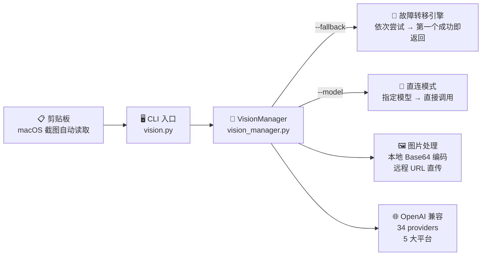

<p align="center">
  
  
  
  
  
</p>

<p align="center">
  <pre style="font-size: 10px; line-height: 1.2;">
  ██╗   ██╗██╗███████╗██╗ ██████╗ ███╗   ██╗    ███╗   ███╗ ██████╗ ███╗   ██╗███████╗████████╗███████╗██████╗
  ██║   ██║██║██╔════╝██║██╔═══██╗████╗  ██║    ████╗ ████║██╔═══██╗████╗  ██║██╔════╝╚══██╔══╝██╔════╝██╔══██╗
  ██║   ██║██║███████╗██║██║   ██║██╔██╗ ██║    ██╔████╔██║██║   ██║██╔██╗ ██║███████╗   ██║   █████╗  ██████╔╝
  ╚██╗ ██╔╝██║╚════██║██║██║   ██║██║╚██╗██║    ██║╚██╔╝██║██║   ██║██║╚██╗██║╚════██║   ██║   ██╔══╝  ██╔══██╗
   ╚████╔╝ ██║███████║██║╚██████╔╝██║ ╚████║    ██║ ╚═╝ ██║╚██████╔╝██║ ╚████║███████║   ██║   ███████╗██║  ██║
    ╚═══╝  ╚═╝╚══════╝╚═╝ ╚═════╝ ╚═╝  ╚═══╝    ╚═╝     ╚═╝ ╚═════╝ ╚═╝  ╚═══╝╚══════╝   ╚═╝   ╚══════╝╚═╝  ╚═╝
  </pre>
  <em>⚠️ 警告：本工具可能会让你的其他图片分析脚本当场失业 ⚠️</em>
</p>

---

<h1 align="center">image-analysis</h1>
<h3 align="center">🔬 多模型聚合的图片分析工具</h3>
<h4 align="center">a.k.a <b>🔥 VISION MONSTER 🔥</b></h4>
<h5 align="center">「一个模型的失败 = 另一个模型的开始」</h5>
<h5 align="center">34 视觉模型 · 5 平台聚合 · 零成本故障切换 · 剪贴板直接贴图 · 一条命令碾压一切</h5>

---

## 🤔 为什么你需要这个？

还在手动换 API key？还在为某个模型宕机而崩溃？还在截图→保存→拖文件这种原始人操作？

**醒醒，2026 年了。** 你的图片分析工作流应该是：

```
截图 → 终端粘贴 → 自动找最好的模型 → 返回结果
```

而不是：

```
截图 → 保存到桌面 → 找文件路径 → 模型挂了 → 换 key → 换 URL → 心态崩了 → 下班
```

---

## ⚡ 三秒入门

```bash
# 克隆
git clone https://github.com/你的用户名/image-analysis.git
cd image-analysis

# 一键创建虚拟环境 + 安装依赖（交互式，回车即用默认路径）
scripts/setup.sh

# 配置（填入你自己的 API key）
cp scripts/config.example.json scripts/config.json
vim scripts/config.json

# 💥 开火
# 方式一：截图后直接分析（macOS 自动读取剪贴板，不传 --image 即可）
scripts/run.sh scripts/vision.py analyze \
  --prompt "这张图里有什么？详细描述" \
  --fallback

# 方式二：分析本地图片或网络图片
scripts/run.sh scripts/vision.py analyze \
  --image ./photo.jpg \
  --prompt "描述这张照片" \
  --fallback

scripts/run.sh scripts/vision.py analyze \
  --image https://example.com/chart.png \
  --prompt "分析图表数据" \
  --fallback
```

**就这。** 比你点外卖还简单。

| 脚本 | 作用 |
|---|---|
| `scripts/setup.sh` | 创建虚拟环境 + 安装依赖，支持 `--venv` 自定义路径 |
| `scripts/run.sh` | 自动激活 venv 并运行 Python 脚本，Apple Silicon 自动适配 arm64 |

> 💡 `setup.sh` 只需执行一次，之后全部用 `run.sh` 运行。

---

## 🧠 核心能力

<table>
<tr>
<td width="50%">

### 🎯 一统江湖
34 个模型，5 个平台，**一套 API** 全部打通。

- 火山引擎 · 豆包全系
- SiliconFlow · Qwen 系列
- 阿里百炼 · Qwen/Omni/Flash/Kimi/MiniMax
- 智谱 · GLM 4.6V
- 商汤 · SenseNova

</td>
<td width="50%">

### 🔄 自动故障转移
`--fallback` 模式下，一个模型挂了自动切下一个。

```
尝试 volc-seed-2-0-pro... 失败 (503)
尝试 sf-35b-1... 失败 (timeout)
尝试 zhipu... OK ✅
[zhipu] 分析结果：图片中...
```

**永不掉线。** 除非你把这 34 个模型全用挂了——那建议你检查一下网络。

</td>
</tr>
<tr>
<td width="50%">

### 📋 剪贴板直接贴图（macOS）
**不传 `--image` 就自动读剪贴板。** 截图后直接跑命令，零文件、零路径、零操作。

```bash
# 截图 → Cmd+Shift+Ctrl+4 → 然后直接：
scripts/run.sh scripts/vision.py analyze \
  --prompt "识别这段错误日志" --fallback
```

从此告别"截图→保存→找文件"的痛苦三连。

</td>
<td width="50%">

### 🧠 思考模式
开启模型的深度思考能力：

```bash
--thinking
```

需要在 `config.json` 中给对应 provider 加上 `"features": ["thinking"]`，让模型先想清楚再回答，准确率直线飙升。

</td>
</tr>
<tr>
<td width="50%">

### 🖼️ 本地/远程通吃
本地图片自动 Base64 编码上传，网络 URL 直接发送。

```bash
--image ./cat.jpg        # 本地
--image https://...      # 远程
--image a.jpg --image b.jpg  # 多图对比
```

支持 jpg / png / gif / webp / bmp

</td>
<td width="50%">

### ⚙️ 灵活输出
```bash
--json          # JSON 格式输出，方便管道
--show-usage    # 显示 Token 用量
--config        # 自定义配置文件路径
```

</td>
</tr>
</table>

---

## 📊 架构（279 行纯 Python，干翻 300MB Electron 应用）



---

## 🎮 命令全景

```bash
# 基础用法
scripts/run.sh scripts/vision.py analyze --image 图.jpg --prompt "描述这张图"

# 🔥 不传 --image = 自动读取剪贴板（macOS）
scripts/run.sh scripts/vision.py analyze --prompt "OCR 识别文字" --fallback

# 多图对比
scripts/run.sh scripts/vision.py analyze \
  --image before.jpg --image after.jpg \
  --prompt "对比两张图的差异" --fallback

# 思考模式 + JSON 输出
scripts/run.sh scripts/vision.py analyze \
  --image screenshot.png \
  --prompt "这个 UI 有哪些可以改进的地方？" \
  --thinking --json --fallback

# 指定特定模型
scripts/run.sh scripts/vision.py analyze \
  --image photo.jpg \
  --prompt "OCR 识别所有文字" \
  --model zhipu

# 显示 Token 用量
scripts/run.sh scripts/vision.py analyze \
  --image chart.png \
  --prompt "分析这张数据图表" \
  --fallback --show-usage
```

---

## 🏗️ 模型矩阵（34 个，全部可用）

| Provider Key | 平台 | 模型 | 备注 |
|---|---|---|---|
| `volc-seed-2-0-pro` | 火山引擎 | doubao-seed-2-0-pro | 旗舰 |
| `volc-seed-2-0-lite` | 火山引擎 | doubao-seed-2-0-lite | 均衡 |
| `volc-seed-2-0-mini` | 火山引擎 | doubao-seed-2-0-mini | 轻量 |
| `volc-code-preview` | 火山引擎 | doubao-seed-2-0-code-preview | 代码专精 |
| `volc-seed-1-6-vision` | 火山引擎 | doubao-seed-1-6-vision | 视觉专精 |
| `volc-1-5-vision` | 火山引擎 | doubao-1-5-vision-pro-32k | 长上下文 |
| `volc-seed-1-6-flash` | 火山引擎 | doubao-seed-1-6-flash | 极速 |
| `volc-seed-1-6` | 火山引擎 | doubao-seed-1-6 | 标准 |
| `volc-seed-1-8` | 火山引擎 | doubao-seed-1-8 | 最新 |
| `sf-35b-1` | SiliconFlow | Qwen3.6-35B-A3B | |
| `sf-35b-2` | SiliconFlow | Qwen3.6-35B-A3B | 备用 |
| `sf-27b-1` | SiliconFlow | Qwen3.6-27B | |
| `sf-27b-2` | SiliconFlow | Qwen3.6-27B | 备用 |
| `ali-qwen3.5-122b` | 阿里百炼 | qwen3.5-122b-a10b | 超大杯 |
| `ali-qwen3.6-plus-0402` | 阿里百炼 | qwen3.6-plus | |
| `ali-qwen3.6-plus` | 阿里百炼 | qwen3.6-plus | 最新 |
| `ali-qwen3.5-plus` | 阿里百炼 | qwen3.5-plus | |
| `ali-qwen3.5-omni-plus-0315` | 阿里百炼 | qwen3.5-omni-plus | 全模态 |
| `ali-qwen3.5-omni-plus` | 阿里百炼 | qwen3.5-omni-plus | 最新 |
| `ali-qwen3.5-omni-flash-0315` | 阿里百炼 | qwen3.5-omni-flash | 全模态快 |
| `ali-qwen3.5-omni-flash` | 阿里百炼 | qwen3.5-omni-flash | 最新 |
| `ali-qwen3.6-35b` | 阿里百炼 | qwen3.6-35b-a3b | |
| `ali-qwen3.5-35b` | 阿里百炼 | qwen3.5-35b-a3b | |
| `ali-qwen3.6-27b` | 阿里百炼 | qwen3.6-27b | |
| `ali-qwen3.5-27b` | 阿里百炼 | qwen3.5-27b | |
| `ali-qwen3.6-flash-0416` | 阿里百炼 | qwen3.6-flash | |
| `ali-qwen3.6-flash` | 阿里百炼 | qwen3.6-flash | 最新 |
| `ali-qwen3.5-flash` | 阿里百炼 | qwen3.5-flash | |
| `ali-qwen3.5-flash-0223` | 阿里百炼 | qwen3.5-flash | |
| `ali-gui-plus` | 阿里百炼 | gui-plus | GUI 专精 |
| `ali-kimi-k2.6` | 阿里百炼 | kimi-k2.6 | Kimi |
| `ali-minimax-m2.5` | 阿里百炼 | MiniMax-M2.5 | MiniMax |
| `sensenova` | 商汤 | sensenova-6.7-flash-lite | 轻量 |
| `zhipu` | 智谱 | glm-4.6v-flash | 默认 |

> 💡 如需为某个 provider 开启思考模式，在 `config.json` 中加入 `"features": ["thinking"]`：
> ```json
> "zhipu": {
>   "api_key": "your-key",
>   "model": "glm-4.6v-flash",
>   "base_url": "https://open.bigmodel.cn/api/paas/v4/chat/completions",
>   "features": ["thinking"]
> }
> ```

</details>

---

## 🧪 真实使用场景

| 场景 | 命令示例 |
|---|---|
| 📋 **剪贴板 OCR** | 截图后直接 `scripts/run.sh scripts/vision.py analyze --prompt "提取所有文字" --fallback` |
| 🧾 **发票识别** | `scripts/run.sh scripts/vision.py analyze --image invoice.jpg --prompt "提取发票号码、金额、日期" --model zhipu` |
| 🎨 **UI 审查** | `scripts/run.sh scripts/vision.py analyze --image mockup.png --prompt "审查设计问题" --thinking --fallback` |
| 📊 **图表分析** | `scripts/run.sh scripts/vision.py analyze --image chart.png --prompt "分析趋势并给出建议" --fallback` |
| 🔬 **对比分析** | `scripts/run.sh scripts/vision.py analyze --image v1.png --image v2.png --prompt "列出所有差异" --fallback` |
| 📸 **照片描述** | `scripts/run.sh scripts/vision.py analyze --image photo.jpg --prompt "详细描述场景、人物、氛围" --fallback` |
| 🔍 **Bug 截图** | `scripts/run.sh scripts/vision.py analyze --image error.png --prompt "根据错误信息给出修复方案" --thinking --fallback` |

---

## 💡 设计哲学

> "一个模型靠不住，那就搞 34 个。" —— 孙子（误）

> "Fallback is not a feature. It's a lifestyle." —— 本项目

> "279 行代码，34 个模型。你还要什么自行车？" —— 我

---

## 🤝 贡献

发现 bug？想加新 provider？想加新 feature？

1. Fork
2. 改代码
3. 提 PR
4. 我请你喝咖啡（虚拟的）

---

## 📜 License

MIT — 随便用，随便改，随便分发。记得 Star ⭐ 就行。

---

<p align="center">
  <b>⭐ 如果这个项目救了你的命，请给它一颗星星 ⭐</b><br/>
  <sub>Made with ☕, 🔥, and pure frustration with API keys</sub>
</p>
